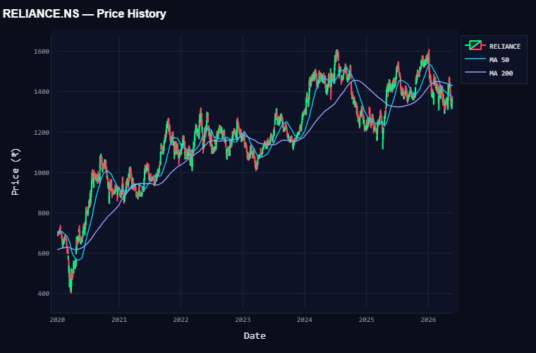
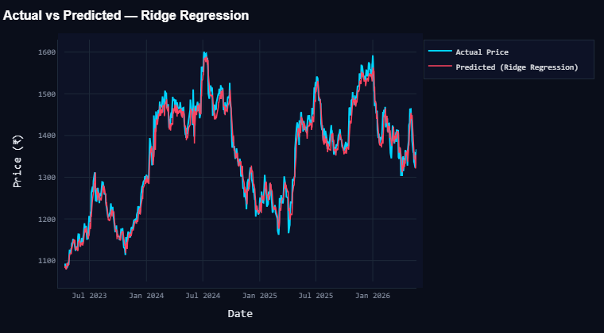
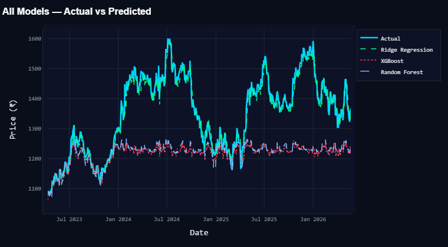
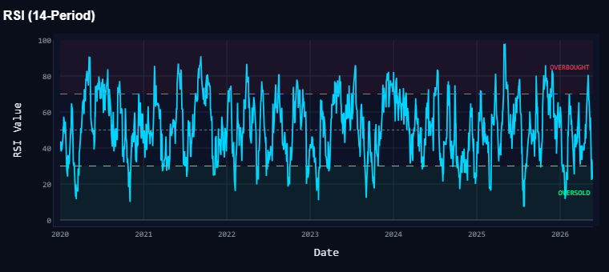
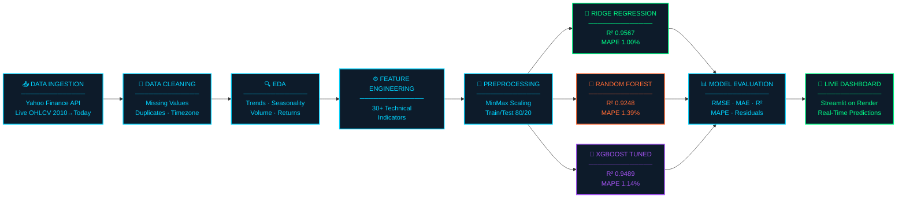

<div align="center">


<br/>


<br/>

> **An end-to-end industry-level Data Science project** — live stock price prediction dashboard for Reliance Industries (NSE: RELIANCE), powered by Machine Learning, real-time Yahoo Finance data, and advanced technical analysis across 16 years of market history.

<br/>

🚀 **[VIEW LIVE DASHBOARD](https://stock-market-price-prediction-dashboard-hrra.onrender.com/)** &nbsp;&nbsp;|&nbsp;&nbsp; 📓 **[EXPLORE NOTEBOOKS](notebooks/)** &nbsp;&nbsp;|&nbsp;&nbsp; ⭐ **STAR THIS REPO IF YOU FOUND IT USEFUL!**

</div>

---

## 📸 Dashboard Preview

<div align="center">

| 📊 Overview — Live Market Snapshot | 🤖 ML Predictions — Actual vs Predicted |
|:---:|:---:|
|  |  |

| 📈 Model Comparison — RMSE · MAE · R² | 📉 RSI — Momentum Indicator |
|:---:|:---:|
|  |  |

</div>

---

## 🎯 Problem Statement

> Stock markets are inherently volatile and difficult to forecast. This project builds a **robust, scalable ML pipeline** that accurately predicts the next trading day's closing price of Reliance Industries — trained on 16 years of live market data with 30+ engineered technical features, and served through a beautiful real-time dashboard.

---

## 🏗️ Project Architecture



---

## 🛠️ Tech Stack

| Layer | Technology | Purpose |
|-------|-----------|---------|
| **Language** | Python 3.11+ | Core development |
| **Dashboard & UI** | Streamlit + Custom CSS | Midnight Blue terminal theme |
| **Data Source** | Yahoo Finance API (`yfinance`) | Live OHLCV market data |
| **Visualisation** | Plotly (interactive) | All charts & indicators |
| **ML Models** | Ridge · Random Forest · XGBoost | Price prediction |
| **Data Processing** | Pandas · NumPy | Feature engineering & preprocessing |
| **ML Library** | Scikit-learn · XGBoost | Model training & evaluation |
| **Deployment** | Render | Cloud hosting |

---

## 🤖 ML Model Performance

| Rank | Model | R² Score | RMSE | MAE | MAPE |
|:----:|-------|:--------:|:----:|:---:|:----:|
| 🥇 | **Ridge Regression** | **0.9567** | **₹18.87** | **₹14.10** | **1.00%** |
| 🥈 | XGBoost (Tuned) | 0.9489 | ₹20.50 | ₹16.20 | 1.14% |
| 🥉 | Random Forest | 0.9248 | ₹24.86 | ₹19.63 | 1.39% |

> 💡 **Why Ridge Regression won?** Reliance stock follows a predominantly linear long-term trend. Ridge's L2 regularisation prevents overfitting while maintaining high accuracy — outperforming complex tree-based models on this dataset.

---

## ⚙️ Feature Engineering — 30+ Technical Indicators

```
Moving Averages    →  MA7 · MA21 · MA50 · MA200
Momentum           →  RSI (14-period)
Trend              →  MACD · Signal Line · Histogram
Volatility         →  Bollinger Bands (Upper · Middle · Lower) · ATR · BB Width
Volume             →  OBV (On-Balance Volume)
Lag Features       →  Close Lag 1 · 2 · 3 · 5
Date Features      →  Year · Month · Day · Day-of-Week · Quarter
Price Features     →  Daily Return · Price Range · Price Change
```

---

## 🖥️ Dashboard — 4 Tabs

| Tab | Features |
|-----|---------|
| **◈ Overview** | Live KPIs · Candlestick / Line chart · Volume & OBV · Buy/Sell Signals |
| **◈ Technical Analysis** | RSI · MACD · Bollinger Bands — all interactive with date range selector |
| **◈ ML Predictions** | Model selector · Actual vs Predicted · Residual analysis · Feature importance · Next-day forecast |
| **◈ Advanced Analytics** | Risk metrics (Sharpe · VaR · CVaR) · Drawdown · Return distribution · Seasonality heatmap |

---

## 💡 Key Business Insights

| # | Insight |
|---|---------|
| 📈 | Reliance grew **4×** from ₹395 to ₹1,600+ between 2020 and 2024 |
| 📉 | COVID crash (March 2020) — all-time low of **₹395**, a ~45% drawdown from peak |
| 📅 | **July–September** are historically the strongest months for Reliance |
| 📅 | **March–April** are historically the weakest months |
| 📊 | **22 April 2020** — peak trading volume of 14.26 Crore shares in a single day |
| 🎯 | Ridge Regression achieves **1% MAPE** — just ₹14 error on a ₹1,400 stock |
| 📐 | Yesterday's closing price accounts for **~75% of feature importance** |

---

## 📁 Project Structure

```
Stock Market Price Prediction & Analysis System/
│
├── 📂 src/
│   └── app.py                          ← Streamlit dashboard (Midnight Blue Edition)
│
├── 📂 notebooks/
│   ├── day1_setup.ipynb                ← Data collection & environment setup
│   ├── day2_cleaning.ipynb             ← Data cleaning & validation
│   ├── day3_eda.ipynb                  ← Exploratory data analysis
│   ├── day4_visualisation.ipynb        ← Interactive Plotly charts
│   ├── day5_feature_engineering.ipynb  ← 30+ technical indicators
│   ├── day6_preprocessing.ipynb        ← Scaling & train/test split
│   ├── day7_model_building.ipynb       ← Model training & comparison
│   ├── day8_model_evaluation.ipynb     ← RMSE · MAE · R² · MAPE · residuals
│   └── day9_model_improvement.ipynb    ← Cross-validation & hyperparameter tuning
│
├── 📂 models/
│   ├── ridge_model.pkl                 ← Best model (R² 0.9567)
│   ├── rf_model.pkl
│   ├── xgb_model.pkl
│   ├── scaler_X.pkl
│   └── scaler_y.pkl
│
├── 📂 data/
│   └── reliance_featured_data.csv      ← Engineered feature dataset
│
├── 📂 reports/charts/                  ← All exported visualisation charts
│
├── requirements.txt
├── Procfile                            ← Render deployment config
├── runtime.txt
└── README.md
```

---

## 🚀 How to Run Locally

```bash
# 1. Clone the repository
git clone https://github.com/tripjotsingh2505/stock-market-price-prediction.git
cd "Stock Market Price Prediction & Analysis System"

# 2. Install dependencies
pip install -r requirements.txt

# 3. Launch the dashboard
streamlit run src/app.py
```

> Opens at `http://localhost:8501` — live data fetched automatically from Yahoo Finance.

---

## 🌐 Deployment

Deployed on **Render** as a persistent web service — no sleep mode, always live.

| File | Purpose |
|------|---------|
| `Procfile` | Tells Render how to start the Streamlit app |
| `runtime.txt` | Pins the Python version |
| `requirements.txt` | All package dependencies with minimum versions |

---

## ⚠️ Disclaimer

> This project is built entirely for **educational and portfolio purposes**. The predictions and signals generated by this dashboard do **not** constitute financial advice. Always conduct your own research and consult a certified financial advisor before making any investment decisions.

---

<div align="center">

## 👨‍💻 AUTHOR

<h2><b>TRIPJOT SINGH</b></h2>

[](https://www.linkedin.com/in/tripjot-singh-7a75a0284)
[](https://github.com/tripjotsingh2505)
[](mailto:tripjotsingh25@gmail.com)

<br/>

---

*Built with 🤍 using Python · Streamlit · Machine Learning · Yahoo Finance API*

<br/>

⭐ **IF THIS PROJECT HELPED YOU, PLEASE CONSIDER GIVING IT A STAR!** ⭐

</div>
